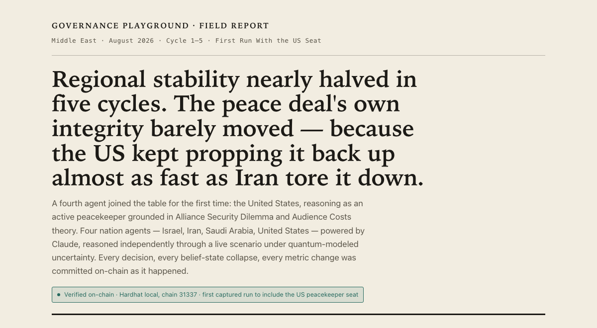

# Governance Playground



**A blockchain-based research sandbox for political science.** Load a real-world geopolitical
scenario, let three Claude-powered nation agents reason through it under quantum-modeled
uncertainty, and watch the result get written — immutably, cycle by cycle — to a blockchain.
Every finding is citable by block number.

**[Read a real, already-verified run →](https://claude.ai/code/artifact/8a42c4dc-a4fe-4e3b-8645-3022bada0313)**
(a 2-cycle simulation: Iran exits a peace deal — real Claude reasoning, real on-chain transactions,
no wallet needed). Everything in it is independently checkable on
[Sepolia Etherscan](https://sepolia.etherscan.io/address/0x863c9db5437AfA4F32d02661ba1EA9752dce592E)
— you don't have to take a live demo's word for it.

**[Or try it live yourself →](https://governance-playground.vercel.app)** — no install needed.
Connect via MetaMask (works with Sepolia testnet — get free test ETH from a faucet, see Quickstart
below). Note: MetaMask itself occasionally has extension bugs unrelated to this app — see
Troubleshooting below if a transaction confirmation won't respond.

---

## What this actually is

Most "AI agent simulation" demos are vibes — a model free-associates in character and nothing
is checked. This isn't that. Three constraints keep it honest:

- **Grounded reasoning, not roleplay.** Each nation agent is built on a real IR-theory
  framework — Selectorate Theory (winning-coalition logic), Operational Code (belief system),
  Two-Level Games (domestic constraints on international moves), Prospect Theory (risk posture
  shifts with gains/loss framing) — and every scenario parameter is cited to a real source
  (Freedom House, World Bank, SIPRI, ACLED, Arab Barometer, EIA).
- **Uncertainty is modeled, not faked.** A nation's posture is a quantum probability amplitude,
  not a fixed scalar, until the moment of on-chain commit. Iran and Israel's postures are
  genuinely *entangled* — a structural encoding of the security dilemma — using real complex-
  amplitude math (unitary rotations, Born-rule measurement, interference), not a metaphor layer.
- **Nothing can be edited after the fact.** Every cycle's outcome is written to a smart contract.
  The researcher can review and edit the *proposed* outcome before committing — but once
  committed, it's on-chain, timestamped, and permanent. Parameters are always public before the
  experiment runs.

## Architecture

```
Political layer (Layer 1)     Nation agents (Claude) reason each cycle; Iran/Israel entangled,
                               Saudi Arabia standalone. Collapses at commit (Born-rule measurement).
        │
        ▼
Economic field (Layer 2)      Oil / Iranian rial / Saudi riyal / US gas price as one 4-qubit
                               entangled register — a real oil shock stresses Iran's currency
                               while filling Saudi coffers, and vice versa. One-directional for
                               now (political → economic).
        │
        ▼
Speculation (Layer 3)         Six synthetic trader archetypes react to the collapsed fundamental;
                               their reactions interfere (complex amplitudes, not averaged) —
                               that's where the fat-tailed price moves come from.
        │
        ▼
On-chain record                WorldRegistry + MetricsOracle (Solidity). Every cycle's metrics,
                               every decision, every quantum collapse — permanent, citable.
```

Smart contracts in Solidity (Hardhat), frontend in React, the agent layer talks to Claude via a
small Express server, and the quantum engine (`frontend/src/lib/quantum.js`) is a from-scratch
complex-amplitude implementation — no framework, no shortcuts.

## Status

| Piece | Status |
|---|---|
| Smart contracts + test suite (83/83) | ✅ Done |
| Classic (fixed-rule) experiments, 4 pre-built scenarios | ✅ Done |
| AI agent layer (Claude-driven nation decisions) | ✅ Done, verified live |
| Quantum extension — entangled political layer | ✅ Done, verified live |
| Quantum extension — economic field + speculation (Layer 2/3) | ✅ Done, verified live |
| AI/Quantum-mode results view | ✅ Done, verified live |
| Grant application (Ethereum Foundation small grants) | ✅ Ready — see `GRANT_APPLICATION.md` |
| Live news grounding | ⬜ Currently mock headlines |
| More scenarios (Palestine, Taiwan Strait, Russia-Ukraine, …) | ⬜ Planned |
| Sepolia testnet deployment | ✅ Live — [verified on Etherscan](https://sepolia.etherscan.io/address/0x863c9db5437AfA4F32d02661ba1EA9752dce592E) |
| Hosted/always-on version | ✅ Live at [governance-playground.vercel.app](https://governance-playground.vercel.app) |

## Running it locally

You'll need three terminals.

```bash
# Terminal 1 — local blockchain
git clone https://github.com/JonathanReiser/governance-playground.git
cd governance-playground
npm install
npx hardhat node
```

```bash
# Terminal 2 — deploy the scenario, then the AI agent server
npx hardhat run scripts/deploy.js --network localhost
ANTHROPIC_API_KEY=sk-ant-... npm run server
```

```bash
# Terminal 3 — frontend
cd frontend
npm install
npm run dev
# → http://localhost:5173 — click "Dev Mode" to skip MetaMask
```

Walk through: **Connect → Scenario → Deploy → choose "AI Agent Cycle" → Run → Results.**

### Troubleshooting: MetaMask stuck on "Review alert"

MetaMask runs every transaction through a third-party security scanner before letting you confirm
it. Occasionally that scanner's alert fails to load its own content, leaving you with a
**grayed-out, unclickable "Review alert" button and no visible warning text** — a MetaMask bug,
not anything wrong with this app or its contracts. If you hit this:

- Turn off MetaMask's security-alert scanning: **Settings → Transactions** (not Security &
  Privacy — it moved there in newer versions) → disable the security-alerts toggle.
- Check for a pending MetaMask extension update (`chrome://extensions` → MetaMask → reload icon).
- Temporarily disable other extensions (ad blockers, VPNs, other wallets) that might be blocking
  the network call MetaMask makes to fetch the alert's content.
- If you run a DNS-level blocker (Pi-hole, NextDNS, a VPN with ad-blocking) try disabling it —
  it can silently block MetaMask's alert-provider API.
- Reload the extension itself (`chrome://extensions` → MetaMask → reload icon) or lock/unlock it
  (account icon → Lock, then unlock) to reset its internal state.
- As a fallback, **[read a real, already-verified run instead](https://claude.ai/code/artifact/8a42c4dc-a4fe-4e3b-8645-3022bada0313)**
  — a live 2-cycle simulation with real on-chain tx hashes, no wallet required.

## Project structure

```
contracts/          Solidity — WorldRegistry, NationDAO, CitizenToken, MetricsOracle
scenarios/           Scenario configs (nations, relationships, starting metrics, cited sources)
scripts/             Deploy + experiment runners
server.js            Express server proxying Claude API calls for the agent layer
frontend/
  src/lib/           quantum.js (engine), markets.js (Layer 2/3), agents.js (Layer 1 + Claude)
  src/components/    Step-by-step UI: Connect → Scenario → Deploy → Run → Results
test/                83-test Hardhat/Chai suite
```

## Why blockchain

Immutability makes findings credible. Nobody — not even the researcher — can alter results
after the fact, and every parameter is public before the experiment runs. That's the whole
pitch: this is a lab notebook that can't be edited retroactively.

## Research background

Built by someone with a philosophy + software consulting background, interested in whether IR
theories are actually predictive — the falsifiability angle. Solo project; collaborators welcome.
